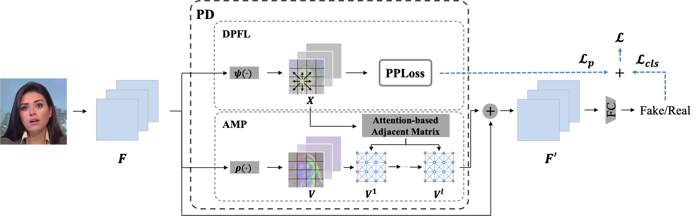

# Patch-Diffusion

This is an official PyTorch implementation of "Patch Diffusion: A General Module for Face Manipulation Detection" in AAAI2022.

## Requirements

~~~shell
conda create -n patch_diffusion python=3.6.10
conda install -y pytorch==1.4.0 torchvision==0.5.0 -c pytorch
pip install numpy==1.18.5
~~~

## Data Preparation

Dataset setup: Follow [these](data_preparation) instructions.

## Patch Diffusion module

You can integrate [pd_module](pd_module.py) in you own network.

## Pairwise Patch Pair Loss

Pairwise Patch Loss ([PPLoss](pploss.py)) to learn effective patch feature representations

## Related Links

- CNN-generated images are surprisingly easy to spot...for now [[Code]](https://github.com/PeterWang512/CNNDetection)

- FaceForensics++: Learning to Detect Manipulated Facial Images [[Code]](https://github.com/ondyari/FaceForensics)

- DSP-FWA: Dual Spatial Pyramid for Exposing Face Warp Artifacts in DeepFake Videos [[Code]](https://github.com/yuezunli/DSP-FWA)

- kaggle-dfdc [[Code]](https://github.com/cuihaoleo/kaggle-dfdc)

## Citation

If you use our code for your research, please cite the following paper:

~~~
@article{zhang2022pd,
  title={Patch Diffusion: A General Module for Face Manipulation Detection},
  author={Baogen Zhang, Sheng Li, Guorui Feng, Zhenxing Qian and Xinpeng Zhang},
  journal={AAAI},
  year={2022}
}
~~~